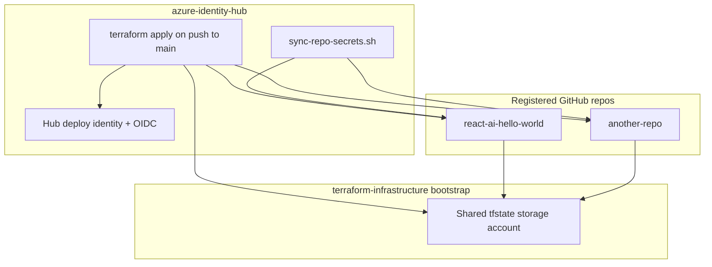

# azure-identity-hub

[](LICENSE)

Central **identity vending** for Azure + GitHub Actions. This hub provisions deploy managed identities, OIDC federated credentials, and least-privilege RBAC for every Terraform repo you register—so you only run a **one-time local bootstrap here**, not once per app repo.

## What this solves

| Without a hub | With this hub |
|---------------|---------------|
| Each new repo needs local Terraform to create identity + OIDC + RBAC | Add repo name to `github_repos.tfvars.json`, push to `main` |
| Client IDs pasted manually into GitHub secrets | CI syncs `AZURE_CLIENT_ID` (and related secrets) to target repos |
| Repeated bootstrap boilerplate | One roster in Terraform, `for_each` on identities |

Your [`terraform-infrastructure`](https://github.com/yauchinlam/terraform-infrastructure) repo owns the **single shared remote state storage account**. Every Terraform repo uses that account with its own state key:

```text
<github-repo-name>/<env>.tfstate
```

For example: `azure-identity-hub/dev.tfstate`, `react-ai-hello-world/dev.tfstate`.

This hub references that shared account and grants each vended identity **Storage Blob Data Contributor** on the shared `tfstate` container.

## Architecture



For each entry in `github_repos`, this stack creates:

| Resource | Purpose |
|----------|---------|
| User-assigned identity | `id-{repo}-{env}-deploy` in the hub resource group |
| Federated credential | Trusts `repo:{owner}/{repo}:ref:refs/heads/main` |
| Resource group (optional) | `rg-{repo}-{env}` when `create_resource_group = true` |
| RBAC Contributor | On the repo's resource group(s) |
| RBAC Storage Blob Data Contributor | On the shared `tfstate` container |

## Repository structure

```
.
├── .github/workflows/terraform.yml   # plan + apply + secret sync on main
├── scripts/sync-repo-secrets.sh      # pushes AZURE_* secrets to vended repos
├── environments/dev/
│   ├── main.tf                       # Hub resource group + hub deploy identity
│   ├── hub-oidc.tf / hub-rbac.tf     # This repo's own CI identity
│   ├── identities.tf                 # for_each over github_repos
│   ├── variables.tf / locals.tf / data.tf / outputs.tf
│   ├── backend.tf                    # Committed shared storage backend config
│   ├── backend.tf.example            # Generic template
│   ├── terraform.tfvars.example      # Template (copy to gitignored terraform.tfvars)
│   ├── hub_settings.tfvars.json.example
│   ├── github_repos.tfvars.json      # Committed repo roster (CI reads this)
│   └── github_repos.tfvars.json.example
```

### Config files

| File | In git? | Purpose |
|------|---------|---------|
| `terraform.tfvars.example` | Yes | Generic template |
| `terraform.tfvars` | **No** (gitignored) | Your `github_owner`, `location`, etc. |
| `backend.tf.example` | Yes | Generic template |
| `backend.tf` | Yes | Shared storage backend; key `{repo-name}/{env}.tfstate` |
| `hub_settings.tfvars.json.example` | Yes | Generic template |
| `hub_settings.tfvars.json` | **No** (gitignored) | Shared tfstate storage reference |
| `github_repos.tfvars.json` | Yes | Repo roster for identity vending |

## Prerequisites

- Terraform `>= 1.5.0`
- Azure CLI (`az login`) with permission to create resource groups, storage, identities, and role assignments
- An existing **shared tfstate storage account** (from `terraform-infrastructure`)
- Target subscription selected: `az account set --subscription "<id>"`

## One-time local bootstrap (this repo only)

Complete these steps **once** on your machine. After that, adding repos is CI-only.

### Step 1 — Configure and first apply (local state)

```bash
cd environments/dev
cp terraform.tfvars.example terraform.tfvars
cp hub_settings.tfvars.json.example hub_settings.tfvars.json
# Edit terraform.tfvars and hub_settings.tfvars.json with your values

az login
az account set --subscription "<subscription-id>"

# Step 1 uses local state — temporarily rename backend.tf so init does not use the remote backend
if (Test-Path backend.tf) { Rename-Item backend.tf backend.tf.hold }

terraform init
terraform plan -var-file=hub_settings.tfvars.json
terraform apply -var-file=hub_settings.tfvars.json
```

State is local until Step 3. Do **not** keep `backend.tf` in place for this first apply.

### Step 2 — Grant your user blob access on shared state

With **`shared_access_key_enabled = false`** on the tfstate account, you need **Storage Blob Data Contributor** on the **shared** storage account before migrating state:

```powershell
$userId = az ad signed-in-user show --query id -o tsv
$scope  = az storage account show --name stterraforminfrastructur --resource-group rg-terraform-infrastructure-dev --query id -o tsv
az role assignment create --role "Storage Blob Data Contributor" --assignee-object-id $userId --assignee-principal-type User --scope $scope
```

Wait 1–2 minutes, then confirm:

```bash
az storage blob list --account-name stterraforminfrastructur --container-name tfstate --auth-mode login
```

### Step 3 — Migrate state to shared storage

```powershell
Rename-Item backend.tf.hold backend.tf
terraform init -migrate-state
```

`terraform.tfvars` and `hub_settings.tfvars.json` stay **gitignored** — do not commit them.

### Step 4 — Configure GitHub secrets on **this hub repo**

| Secret | Source |
|--------|--------|
| `AZURE_CLIENT_ID` | `terraform output -raw hub_identity_client_id` |
| `AZURE_TENANT_ID` | `terraform output -raw tenant_id` |
| `AZURE_SUBSCRIPTION_ID` | `az account show --query id -o tsv` |
| `AZURE_LOCATION` | Same as `location` in `terraform.tfvars` |
| `TF_VAR_github_owner` | Same as `github_owner` in `terraform.tfvars` |
| `REPO_SECRET_SYNC_TOKEN` | Fine-grained PAT with **Secrets** write on target repos (optional but recommended) |
| `HUB_SETTINGS_TFVARS` | Full contents of your `hub_settings.tfvars.json` (one-line JSON is fine) |

```bash
gh secret set AZURE_CLIENT_ID --body "<hub_identity_client_id>" --repo <owner>/azure-identity-hub
# ... repeat for other secrets
```

### Step 5 — Push to main

Hub CI runs `terraform plan`, `terraform apply`, then `scripts/sync-repo-secrets.sh` to push client IDs to registered repos.

## Branch protection

`main` requires a pull request before merge. Direct pushes to `main` are blocked. Feature branches run **Terraform (plan)** on the PR; **Terraform (apply)** runs after merge.

## Adding a new repo (pull request workflow)

`main` is branch-protected. Register repos via a feature branch and pull request.

### Branch naming

Use **`feature/{repo-name}`**, where `{repo-name}` matches the GitHub repository name (the map key in `github_repos.tfvars.json`):

```text
feature/portfolio-website
feature/react-ai-hello-world
```

### Steps

1. Create a branch from `main`:

```bash
git checkout main
git pull
git checkout -b feature/portfolio-website
```

2. Edit **`environments/dev/github_repos.tfvars.json`** and add the repo. The map key must match the GitHub repo name:

```json
{
  "github_repos": {
    "portfolio-website": {
      "create_resource_group": true,
      "branch": "main",
      "sync_github_secret": true
    }
  }
}
```

3. Open a pull request to **`main`**. Include the target repo URL in the PR description, e.g. https://github.com/yauchinlam/portfolio-website. CI runs **`Terraform (plan)`** on the PR.
4. Merge the PR. CI on **`main`** applies the change and syncs secrets to the target repo.

The target repo's first Terraform apply can run entirely in **its own CI**—point `backend.tf` at the shared storage account with key `{repo-name}/dev.tfstate`.

### Existing resource group

If the resource group already exists (e.g. from a prior bootstrap):

```hcl
"terraform-infrastructure" = {
  create_resource_group = false
  resource_group_name   = "rg-terraform-infrastructure-dev"
  sync_github_secret    = false  # already configured manually
}
```

To bring an existing identity under hub management, use `terraform import`—otherwise leave that repo's identity outside the hub and only register **new** repos.

### Extra Contributor scopes

Grant Contributor on additional scopes (existing resource IDs):

```hcl
"my-repo" = {
  contributor_scopes = [
    "/subscriptions/.../resourceGroups/rg-other-dev"
  ]
}
```

## Hub identity permissions

The hub deploy identity receives:

| Role | Scope | Why |
|------|-------|-----|
| Contributor | Hub resource group | Manage hub identities and federated credentials |
| Storage Blob Data Contributor | Shared `tfstate` container | Read/write this repo's state blob (`azure-identity-hub/dev.tfstate`) |
| User Access Administrator | Subscription (default) or `hub_role_assignment_scope` | Assign RBAC to vended identities |
| Contributor | Subscription | Create vended resource groups |

The subscription-level roles are required for automated identity vending. Narrow `hub_role_assignment_scope` in a local-only `terraform.tfvars` override if your org allows a tighter scope.

## Outputs

| Output | Use |
|--------|-----|
| `hub_identity_client_id` | `AZURE_CLIENT_ID` for **this** hub repo's CI |
| `repo_identity_client_ids` | Map of repo name → client ID for vended repos |
| `repo_oidc_subjects` | Verify OIDC trust per repo |
| `terraform_backend_state_key` | State key for this hub repo (`azure-identity-hub/dev.tfstate`) |
| `repo_terraform_backend_state_keys` | State key per vended repo |
| `repo_resource_group_names` | RG names for target repo docs |

## Target repo checklist

After a repo is registered and secrets are synced:

1. Add `backend.tf` pointing at shared storage with key `{repo-name}/dev.tfstate`:

```hcl
terraform {
  backend "azurerm" {
    resource_group_name  = "rg-terraform-infrastructure-dev"
    storage_account_name = "<shared storage account>"
    container_name       = "tfstate"
    key                  = "my-app/dev.tfstate"
    use_azuread_auth     = true
    use_oidc             = true
  }
}
```

2. Add `.github/workflows/terraform.yml` mirroring your bootstrap pattern (`use_oidc = true`, `azure/login`, ARM_* env vars).
3. Run first apply via CI on `main`—no laptop required.

## Security notes

- Client IDs live in **GitHub Secrets**, not in git history.
- Removing a repo from `github_repos` destroys its vended identity and federated credential on next apply—plan carefully.
- Compromise of hub CI or the hub identity affects provisioning for all registered repos.
- `REPO_SECRET_SYNC_TOKEN` is powerful; use a fine-grained PAT limited to required repos.

## Troubleshooting

| Issue | Check |
|-------|-------|
| Hub CI auth fails | Secrets set, workflow on `main`, OIDC subject matches this repo |
| Secret sync skipped | `REPO_SECRET_SYNC_TOKEN` secret missing on hub repo |
| Role assignment fails | Applying principal needs Owner/UAA; hub identity needs UAA after first apply |
| Shared tfstate data source fails | `shared_tfstate` names match `terraform-infrastructure` outputs |
| Target repo 403 on state | Vended identity has Storage Blob Data Contributor on shared container |

## License

MIT — see [LICENSE](LICENSE).

Copyright (c) 2026 Yauchin M. Lam
